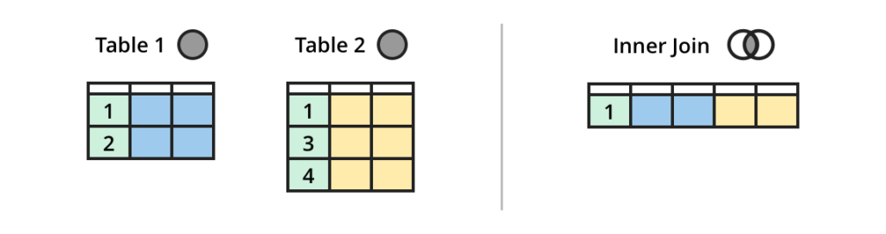

# 04 - SQL Joins

## Understanding Keys

- **Primary Keys**: Unique and non-null fields that identify each record in a table. A table can have at most one primary key, possibly composed of multiple columns.
- **Foreign Keys**: Fields in one table that refer to the primary key of another table. A table can have multiple foreign keys.

---

## Example Join Query

Here's how we can find all tracks from Aerosmith in a single query:

```sql
SELECT DISTINCT(tracks.name)
FROM artists
JOIN albums ON artists.artistId = albums.artistId
JOIN tracks ON albums.albumId = tracks.albumId
WHERE artists.name = 'Aerosmith';
```

In this dataset:
- `artists.artistId` is the primary key
- `albums.artistId` is a foreign key referencing `artists`
- `tracks.albumId` is a foreign key referencing `albums`

---

## Part 1: Exploring Different Types of Joins

### Outer Join


### Inner Join



### Left Join


> Right joins are symmetrical to left joins but less commonly supported in SQLite.

---

## Exercises: Putting It Together!

Now that you’ve explored different SQL commands, write queries for each of the following tasks.

### 1. Show the first 10 tracks with their album names

```sql
SELECT Name, Title
FROM tracks t
LEFT JOIN albums a
ON t.AlbumId = a.AlbumId
LIMIT 10;
```

> Tip: Using table aliases like `t` and `a` makes the query more concise.

---

### 2. List all albums by the artist "Queen"

Expected output: Album titles of Queen.

---

### 3. Count how many tracks are in each genre

Use `GROUP BY genreId` and a join with the genres table.

---

### 4. Calculate the average price of tracks per genre (rounded to two decimal places)

Use `AVG()` and `ROUND()` functions with a join.

---

### 5. Find total sales per customer

Join invoices, invoice_items, and customers; group by customer.

---

### 6. Total sales by month

Use `strftime('%Y-%m', InvoiceDate)` and group by it.

---

### 7. Highest-spending customers by employee

Group by both employee and customer to sum total sales.

---

### 8. Challenge: Top-selling genre (by quantity sold) in each country

Use views or common table expressions (CTEs) with grouping and ranking.

---

### 9. Mega Challenge: Album track sales and ranking per artist

Output: Total tracks sold per album, and rank within artist group.

---

## Resources

- [SQL Join Types Explained Visually – Atlassian](https://www.atlassian.com/data/sql/sql-join-types-explained-visually)

---

## Pedagogical Objectives

- Understand primary and foreign keys  
- Become familiar with common types of joins  
- Combine SQL commands through practical exercises
