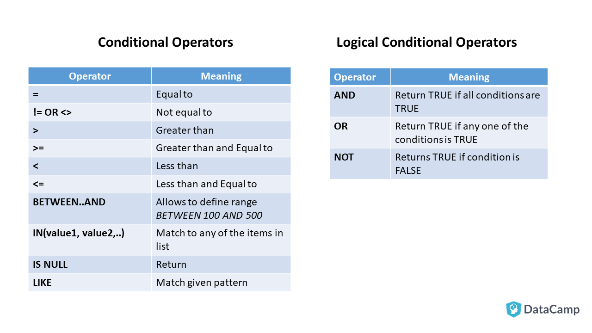

# Additional Topics

You've uncovered the basics of SQL! However, there are many topics to expand your knowledge.  

## Topic 1: Conditionals in SQL

Conditionals help us add logical statements to our SQL queries and be able to apply different approaches according to different conditions.



### Example Tasks:
1. Add a new column classifying each track as:  
   - 'Short' if under 2 minutes  
   - 'Medium' if 2–5 minutes  
   - 'Long' if over 5 minutes  

2. Label customers as 'High', 'Medium', or 'Low' spenders based on total purchase amount:  
   - High: > $50  
   - Medium: $20–$50  
   - Low: < $20  

3. Show genres that have sold more than 500 tracks, and mark them as "Top Seller" or "Regular". 

4. Classify invoices as "Recent" if from 2013 or later, otherwise "Older".

**Read more:**
- [SQL CASE Expression – W3Schools](https://www.w3schools.com/sql/sql_case.asp)
- [SQL Conditional Join – Interview Query](https://www.interviewquery.com/p/sql-conditional-join)

---

## Topic 2: Views in SQL

A view is a virtual table based on a SQL query. It does not store data itself but instead displays the result of a stored query whenever it's accessed.

Think of it like a saved query that behaves like a table — you can SELECT from it just like a regular table.

```sql
CREATE VIEW view_name AS
SELECT ...
FROM ...
WHERE ...;
```

Query it like:

```sql
SELECT * FROM view_name WHERE ...;
```

### Why Use Views?

| Purpose             | Description |
|---------------------|-------------|
| Simplify Complex Queries | Hide joins, calculations, and subqueries |
| Restrict Data Access     | Show only certain columns or rows |
| Reuse Logic              | Encapsulate business rules |
| Build Abstractions       | Modular design in larger apps |
| Focused Views            | Provide only needed structure |

**Read more:**
- [What is an SQL View? – LearnSQL](https://learnsql.com/blog/sql-view/)

---

## Topic 3: Importing and Exporting Data

Data transfer is a crucial feature that enables you to export/import data in various formats and move data between tables or databases.

**Exercises:**
1. Export a custom query result to a `.csv` file.  
2. Export the genres table as an SQL insert script.  
3. Import a `.csv` file as a new table in the same database.  
4. Transfer the `tracks` table to another SQLite database.  
5. Use DBeaver’s task scheduler to export a view weekly (Enterprise only).  

   - Create the view  
   - Right-click the view ➜ Export Data ➜ CSV  
   - In the export wizard, go to the Schedule tab  
   - Set recurrence (e.g., every Monday at 9 AM)  
   - Finish and save the task  

**Read more:**
- [Data Transfer in DBeaver](https://dbeaver.com/docs/dbeaver/Data-transfer/#supported-formats)

---

## Topic 4: Subqueries and Common Table Expressions (CTEs)

Complex queries often require intermediate results. These can be created with subqueries or CTEs.

### Techniques:

| Technique | When it Shines | Basic Form |
|----------|----------------|-------------|
| Subquery | One-off filters | `SELECT ... FROM (SELECT ...) AS x;` |
| CTE      | Reusable logic  | `WITH cte_name AS (SELECT ...) SELECT ... FROM cte_name;` |

### Exercises:
1. List the customers who spent more than the average invoice total  
2. List the three longest tracks in each genre  

---

## Pedagogical Objectives

- Explore supplemental topics through independent study
